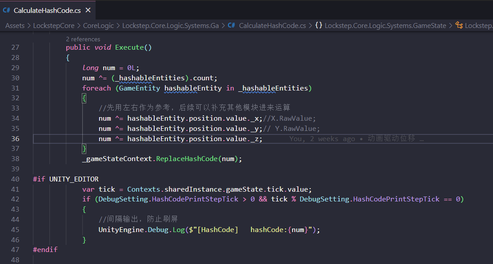

# ActorID、Id、LocalId 的关系

在整个框架内，我们主要关心 GameEntity 下的 Component，其中有几个 Component 的概念必须分清楚

- ActorID  
- LocalId 
- Id

## ActorIdComponent

相当于阵营，这种Component 在 RTS游戏下比较有作用，可以保留

## IdComponent

意思比较直接，就是单独表示Id，作为一种唯一表示，但是在某些情况就比较特别，例如快照数据

## LocalIdComponent 

这个概念很容易混淆，其实这都源于 快照数据，因为快照数据也会创建GameEntity，并且也是带 IdComponent 的，所以为了区分，那么就需要新的特别Id，也就有了LocalId。如下，创建快照数据：

  

# HashCode 检验同步

  

通过 Position 检验，可涵盖99%，后续也可以继续补充

# 帧同步录像

总得来说，我们需要更直接的保存操作指令，并且直接同步持久化存储的操作指令去恢复游戏。

# 确定性物理

# Timeline

---

# TODO

- [x] EntityType 描述 GameEntity
- [x] Jenny 代码生成器，更快生成 ECS 代码
- [ ] ECS 下，预测、预表现测试
- [ ] 外网网络环境测试
- [x] GameEntityManager 通用逻辑
- [ ] 重构动画导出工具
- [x] HashCode 验证
- [ ] 引入确定性物理
- [ ] 帧同步录像模块
- [ ] 尝试引入Timeline
- [ ] Entitas 内的JobSystem （注：子线程下不允许修改 Transform 内的Position 和 Rotation）
- [ ] Animancer 应用
- [x] 接入InputSystem
