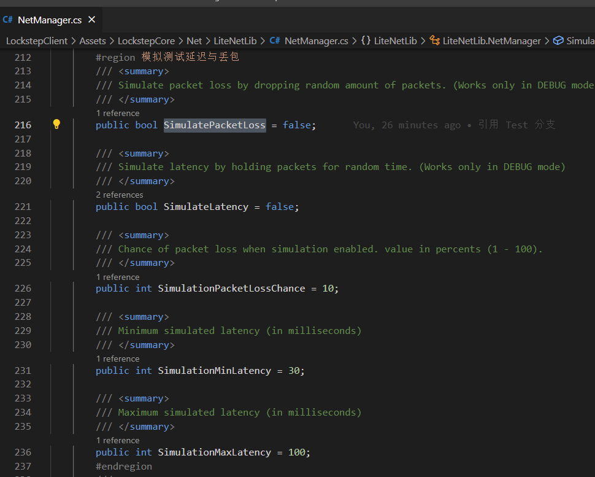

- [Start](#start)
- [回滚与追帧](#回滚与追帧)
- [预测](#预测)
- [定点数与确定性物理](#定点数与确定性物理)
- [LiteNetLib](#litenetlib)
  - [可靠UDP](#可靠udp)
  - [压缩通讯包](#压缩通讯包)
- [关于Debug](#关于debug)
  - [LiteLibNet 网络环境设置](#litelibnet-网络环境设置)
  - [Link.bat 生成同源代码工程](#linkbat-生成同源代码工程)
- [TODO](#todo)
- [参考](#参考)

# Start

初始构建工程需要运行 Link.bat，生成 Server 工程。

这样做主要是为了省事，方便在Unity 内写Server 代码，不然还得开一个单独的C# 工程。

运行游戏需要按照以下步骤：

- 分别打开 LockstepClient 、LockstepServer 两个工程
- LockstepServer 工程打开 LaunchServer 场景，作为房主Server端
- LockstepClient 工程打开 LaunchClient 场景，作为Client

  

- 设定好IP、端口后，进行链接，进入游戏

  


# 回滚与追帧

有实现，但未做大量验证，后续补充

基础移动的测试：


大量Entity压测：


# 预测

可预测执行，防止延迟等待

# 定点数与确定性物理

定点数有FixMath，但是没有 Vector3 方面的实现。

可以考虑用上可靠物理库<https://github.com/Kimbatt/unity-deterministic-physics>

这样可以把碰撞等一系列问题一起解决。


# LiteNetLib

需要验证外网环境，测试性能

## 可靠UDP

LiteNetLib 可靠 UDP 的实现.


在 ReliableChannel 下，管理一个发送包窗口，对每个 NetPacket 进行有限时间内的收包确认。

如下，发送方对数据包进行顺序确认接收处理。

  


如下，接收方对数据包进行逐个回应，将确认接收发送给数据的发送方

```CSharp

 public override bool ProcessPacket(NetPacket packet)
 {
    //...
    //滑动窗口确认包
    int ackIdx;
    int ackByte;
    int ackBit;
    lock (_outgoingAcks)
    {
        if (relate >= _windowSize)
        {
            //调整滑动窗口的位置
            int newWindowStart = (_remoteWindowStart + relate - _windowSize + 1) % NetConstants.MaxSequence;
            _outgoingAcks.Sequence = (ushort)newWindowStart;

            //清理旧数据
            while (_remoteWindowStart != newWindowStart)
            {
                ackIdx = _remoteWindowStart % _windowSize;
                ackByte = NetConstants.ChanneledHeaderSize + ackIdx / BitsInByte;
                ackBit = ackIdx % BitsInByte;
                _outgoingAcks.RawData[ackByte] &= (byte)~(1 << ackBit);
                _remoteWindowStart = (_remoteWindowStart + 1) % NetConstants.MaxSequence;
            }
        }
        //...
        //...
        //...
        if ((_outgoingAcks.RawData[ackByte] & (1 << ackBit)) != 0)
        {
            //未确认的数据，放入发送队列中，进行确认接收
            NetDebug.Write("[RR]ReliableInOrder duplicate");
            //because _mustSendAcks == true
            AddToPeerChannelSendQueue();
            return false;
        }

        //写入最新状态数据
        _outgoingAcks.RawData[ackByte] |= (byte)(1 << ackBit);
    }
 }


```


## 压缩通讯包

压缩、解压 Byte

# 关于Debug

在游戏开发过程中，我们希望有便捷的测试方式，例如测试网络波动、PVP弱网同步。

在此，我们通过一些测试方式，让游戏BUG更早暴露出来，进而提前修复BUG，而不是等待打包之后再去验证。

## LiteLibNet 网络环境设置

如下，设置丢包率、延迟时间等等，都可以比较真实的模拟到外网的复杂情况。

后续可以拓展到UnityEditor下，提供这个可视化设置的窗口。。

  

## Link.bat 生成同源代码工程

我们通过执行路径下的 Link.bat，在同一个root 路径下，生成Server的链接工程，相当于Server工程链接Client的硬盘文件，Server本身没有真正的内容，这样方便Unity 开两个工程，验证PVP。

如下，Server 链接：

  


---

# TODO

- EntityType 描述 GameEntity
- Jenny 代码生成器，更快生成 ECS 代码
- ECS 下，预测、预表现测试
- 外网网络环境测试
- GameEntityManager 通用逻辑
- 重构动画导出工具


---
# 参考


UnityLockstep
<https://github.com/proepkes/UnityLockstep>

Inspired by LockstepFramework, in memory of SnpM:
<https://github.com/SnpM/LockstepFramework>

Uses a fork of BEPUPhysics for deterministic physics:
<https://github.com/sam-vdp/bepuphysics1int>

Uses FixedMath.Net for deterministic fp-calculations:
<https://github.com/asik/FixedMath.Net>

Uses Entitas as ECS Framework:
<https://github.com/sschmid/Entitas-CSharp>

The project includes an implementation example using LiteNetLib:
<https://github.com/RevenantX/LiteNetLib>

Initial commit was targeting the following protocol: https://www.reddit.com/r/Unity3D/comments/aewepu/rts_networking_simulate_on_serverbeat/.  The project has shifted to an architecture you see above.


